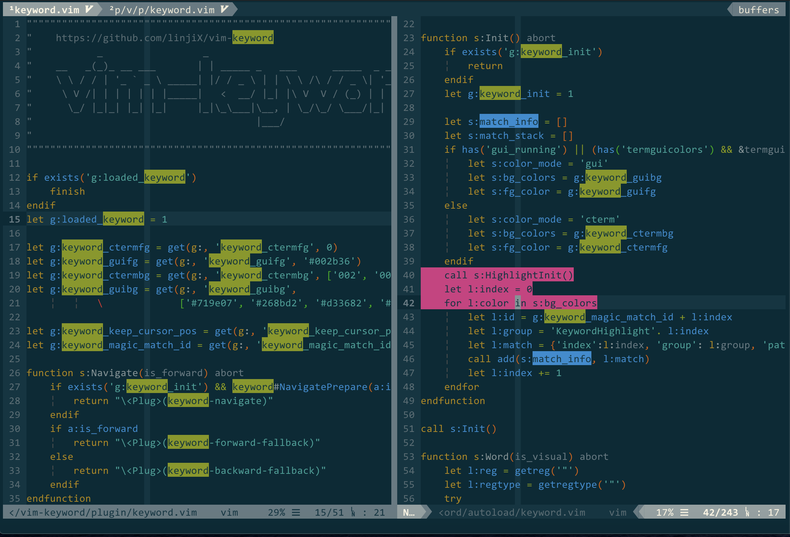

# vim-keyword

highlight multiple different words for better reading



## Features

-   Highlight multiple different words
    -   Support highlight words in all windows and tabs
    -   Support highlight text which has multiple lines
-   Highlight words navigation
    -   Support `[count]n` navigation

## Installation

with [vim-plug](https://github.com/junegunn/vim-plug)

```vim
Plug 'linjiX/vim-keyword'

" Or you can use vim-plug's on-demand loading
Plug 'linjiX/vim-keyword', {'on': '<Plug>(keyword-'}
```

## Mappings

```vim
" <leader>h for highlight the word under cursor
nmap <silent> <leader>h <Plug>(keyword-highlight)

" <leader>h for highlight the visual select word
vmap <silent> <leader>h <Plug>(keyword-highlight)

" <BS> for clear all highlights
nmap <silent> <BS> <Plug>(keyword-clear)

" n and N for navigate highlight words forward and backward
nmap n <Plug>(keyword-forward)
nmap N <Plug>(keyword-backward)
```

## Configurations

### Highlight color

Cterm mode color:

```vim
let g:keyword_ctermfg = 0

" The max number of highlight words depends on the length of 'g:keyword_ctermbg'
let g:keyword_ctermbg = ['002', '004', '005', '006', '013', '009']
```

Gui mode color:

```vim
let g:keyword_guifg = '#002b36'

" The max number of highlight words depends on the length of 'g:keyword_guibg'
let g:keyword_guibg = ['#719e07', '#268bd2', '#d33682', '#2aa198', '#6c71c4', '#cb4b16']
```

### Navigation fallback

When using the navigation feature, if the word under cursor is not a highlight word,
the navigation operation will fallback to vim default `n` and `N` navigation.
If you want to change above default behavior, here is some reference.

```vim
" Disable the fallback
nnoremap <Plug>(keyword-forward-fallback) <NOP>
nnoremap <Plug>(keyword-backward-fallback) <NOP>
```

```vim
" Combine with 'google/vim-searchindex' (https://github.com/google/vim-searchindex)
nnoremap <silent> <Plug>(keyword-forward-fallback) n:SearchIndex<CR>
nnoremap <silent> <Plug>(keyword-backward-fallback) N:SearchIndex<CR>
```

## Related Works & References

-   [vim-interestingwords](https://github.com/lfv89/vim-interestingwords)
